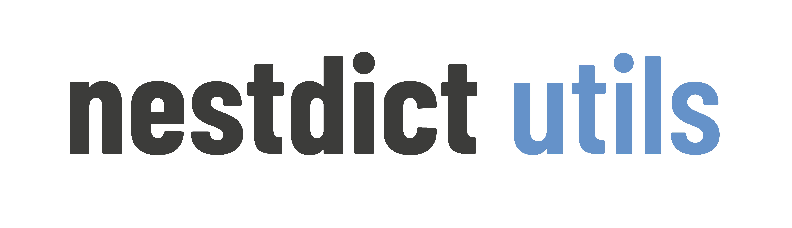

<h1 align="center">

</h1><br>

`nestdictutils` is a Python package providing several utilities to work with and manipulate nested dictionaries.

* **Installation**: [placeholder]
* **Documentation**: [placeholder]
* **Bug reports**: [placeholder]

Testing:

`nestdictutils` requires `pytest`. Tests can be run after installation by launching the following command inside the installation directory:

```
pytest
```


